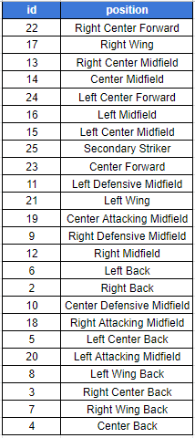
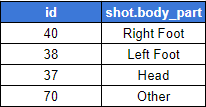
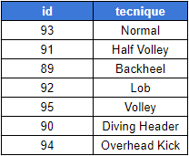
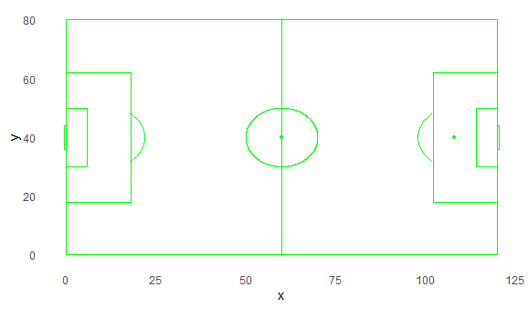
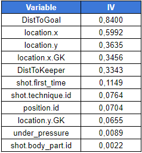
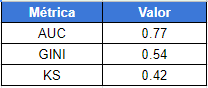

## **Modelo de goles esperados**

En el siguiente dashborad se puede apreciar el funcionamiento de un modelo predictivo de goles esperados, donde de acuerdo a ciertas características es posible saber la propabilidad de que un disparo sea gol o no.

El modelo fue elaborado usando toda la información de libre acceso disponible en el paquete StatsbombR, la cual cuenta con una gran competiciones dentro de las que destacan,

* **La Liga**: contiene información sobre 17 temporadas diferentes, empezando por la temporada 04/05.

  

* **Champions League**: contiene información sobre 15 finales de esta competición, se cuenta con juegos desde el 2003/004.

  

* **Women's Super League**: contiene información sobre tres temporadas de la máxima competición del futbol femenino en Inglaterra.

  

* **Fifa World Cup 2018**: información de todos los partidos del mundial.

  

* **Women's World Cup 2019**: información de todos los partidos del mundial.

  

* **Eurocopa 2020**: información de todos los partidos de la eurocopa.

  

* **Eurocopa femenina 2022**: información de todos los partidos de la eurocopa.

  

* **NWSL 2018**: contiene información sobre la temporada 2018 de la máxima competición del futbol femenino en Estados Unidos.

  

* **Premier League 2004**: información sobre algunos partidos de la temporada 2004.

  

Esta información se caracteriza por presentar los eventos de las situaciones que ocurren en un partido de futbol, en particular existe información sobre los disparos o remates al arco, cada remate tiene sus características propias además de tener el resultado del disparo, el cual puede ser gol, desviado, bloqueado, detenido por el arquero entre otros.

Estas caracteristicas pueden ser usadas en un modelo de predicción con el fin de predecir la probabilidad de ocurrencia del envento en estudio, el cual en este caso es que un disparo acabe en gol.

## **Metodología usada**

#### **1. Consolidación de la data**

En este paso se consolidó toda la información de las competiciones descritas anteriormente, para luego filtrar las misma por el evento relacionado con los disparos.

#### **2. Creación de la variable objetivo y selección de las variables**

Una vez obtenida la base se procede a identificar la variable con la cual se va a crear el target del modelo, en este caso la variable usada es el resultado del disparo, la cual tiene los siguientes niveles,

* **Blocked**: disparo bloqueado.
* **Goal**: disparo que termina en gol.
* **Off T**: disparo desviado.
* **Post**: disparo al poste.
* **Saved**: disparo detenido por el arquero.
* **Saved Off Target**: disparo que iba por fuera que fué detenido por el arquero.
* **Saved to Post**: dispara detenido que luego fue al poste.
* **Wayward**": disparo sin peligro.

Para más detalle se acceder a este <a href="https://github.com/statsbomb/open-data/tree/master/doc" target="_blank">enlace</a>. A partir de las categorías anteriores se generó una variable binaria con 1 es gol y 0 es el resto de niveles.

Una vez generada la variable objetivo se procede a la selección de las variables finales, las variables a usar en esta versión son,

* **under_pressure**: variable binaria que indica si el jugador disparó bajo presión. 
* **position.id**: posición del jugador.

  

* **shot.first_time**: variable binaria que indica si el jugador disparó por primera vez. 
* **shot.body_part.id**: parte del cuerpo con el que se realizó el disparo.

  

* **shot.technique.id**: tecnica del remate.

  

* **location.x**: posición x del jugador al momento del disparo.
* **location.y**: posición y del jugador al momento del disparo.
* **location.x.GK**: posición x del arquero al momento del disparo.
* **location.y.GK**: posición y del arquero al momento del disparo.
* **DistToGoal** : variable calculada internamente como la distancia entre las coordenadas del disparo y el punto (120,40) que representa la línea de gol.
* **DistToKeeper**: variable calculada internamente como la distancia entre las coordenadas del arquero y el punto (120,40) que representa la línea de gol. 

En cuanto a las dimensiones del campo la siguiente imagen es útil para tener una referencia, los valores vienen expresados en metros,

  

Mejores versiones pueden ser creadas al agregar más variables que se encuentran disponibles en la base.

#### **3. Limpieza y poder predictivo de las variables**

Luego de lelegir las variables se procede a limpiar posibles outliers y a obtener el valor del IV ó information value el cual es un indicardor del poder predictivo de las variables a usar, los resultados otenidos son,

  

  

#### **4. Creación del modelo y desempeño**

Utilizando la base anterior se generó el modelo de predicción el cual cuenta con las siguientes métricas de desempeño, 

  

A priori se observa con buen desempeño, sin embargo es recomendable hacer pruebas extra para demostrar el funcionamiento del modelo.

#### **5. Predicción y creación dashboard**

Usando la librería Shiny de R se puede generar el presente dashboard con el fin de observar y probar el funcionamiento del modelo creado.

 

