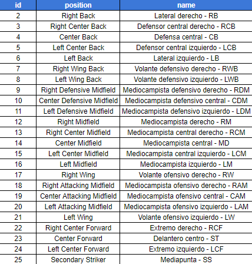
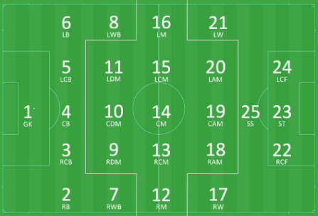
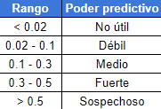

## **Modelo de goles esperados**

En el siguiente dashboard se puede apreciar el funcionamiento de un modelo predictivo de goles esperados, donde de acuerdo a ciertas características es posible saber la probabilidad de que un disparo sea gol o no.

El modelo fue elaborado usando toda la información de libre acceso disponible en el paquete StatsbombR, la cual cuenta con un gran número de competiciones dentro de las que destacan,

* **La Liga**: contiene información sobre 17 temporadas diferentes, empezando por la temporada 04/05.

  

* **Champions League**: contiene información sobre 15 finales de esta competición, se cuenta con juegos desde el 2003/004.

  

* **Women's Super League**: contiene información sobre tres temporadas de la máxima competición del futbol femenino en Inglaterra.

  

* **Fifa World Cup 2018**: información de todos los partidos del mundial.

  

* **Fifa World Cup 2022**: información de todos los partidos del mundial.

  

* **Super Liga India temporada 2021/2022**: información de todos los partidos de esta temporada.

  

* **Women's World Cup 2019**: información de todos los partidos del mundial.

  

* **Eurocopa 2020**: información de todos los partidos de la eurocopa.

  

* **Eurocopa femenina 2022**: información de todos los partidos de la eurocopa.

  

* **NWSL 2018**: contiene información sobre la temporada 2018 de la máxima competición del futbol femenino en Estados Unidos.

  

* **Premier League 2004**: información sobre algunos partidos de la temporada 2004.

  

Esta información se caracteriza por presentar los eventos de las situaciones que ocurren en un partido de futbol, en particular existe información sobre los disparos o remates al arco, cada remate tiene sus características propias además de tener el resultado del disparo, el cual puede ser gol, desviado, bloqueado, detenido por el arquero entre otros.

Estas caracteristicas pueden ser usadas en un modelo de predicción con el fin de predecir la probabilidad de ocurrencia del envento en estudio, el cual en este caso es que un disparo acabe en gol.

## **Metodología usada**

#### **1. Consolidación de la data**

En este paso se consolidó toda la información de las competiciones descritas anteriormente, para luego filtrar las misma por el evento relacionado con los disparos.

#### **2. Creación de la variable objetivo y selección de las variables**

Una vez obtenida la base se procede a identificar la variable con la cual se va a crear el target del modelo, en este caso la variable usada es el resultado del disparo, la cual tiene los siguientes niveles,

* **Blocked**: disparo bloqueado.
* **Goal**: disparo que termina en gol.
* **Off T**: disparo desviado.
* **Post**: disparo al poste.
* **Saved**: disparo detenido por el arquero.
* **Saved Off Target**: disparo que iba por fuera que fué detenido por el arquero.
* **Saved to Post**: dispara detenido que luego fue al poste.
* **Wayward**: disparo sin peligro.

Para más detalle se puede acceder a este <a href="https://github.com/statsbomb/open-data/tree/master/doc" target="_blank">enlace</a> y observar la documentación de todos los eventos y variables disponibles en la data. Antes de crear la variable se eliminaron las observaciones relacionadas con los siguientes niveles "Off T", "Wayward", "Blocked", "Post" y "Saved off Target" debido a que son remates que no generan peligro real. 

A partir del resto de categorías se generó una variable binaria donde 1 corresponde al nivel "Goal" y 0 el resto de niveles. 

Una vez generada la variable objetivo se procede a la selección de las variables finales, las variables a usar en esta versión son,

* **under_pressure**: variable binaria que indica si el jugador disparó bajo presión. 
* **position.id**: posición del jugador.

  

Posiciones consideradas en el campo,

  

* **shot.first_time**: variable binaria que indica si el jugador realizó el disparo de primera, es decir, sin un previo control del balón. 
* **shot.body_part.id**: parte del cuerpo con el que se realizó el disparo.

  

* **shot.technique.id**: tecnica del remate.

  

* **location.x**: coordenada “x” desde donde se efectuó el  disparo. Debe estar en el rango (0,120), por defecto las ocasiones siempre son en la arquería donde finaliza el campo, por lo tanto las coordenadas x deben estar cerca de esa zona para tener resultados precisos.
* **location.y**: coordenada “y” desde donde se efectuó el  disparo.

  

Por defecto Statsbomb usa para las coordenadas "y" la representación de arriba, es decir, su origen se encuentra en el extremo superior derecho.

* **location.x.GK**: coordenada “x” del arquero al momento del disparo.
* **location.y.GK**: coordenada “y” del arquero al momento del disparo.

**Métricas generadas internamente**

* **DistToGoal** : variable calculada internamente como la distancia entre las coordenadas del disparo y el punto (120,40) que representa la línea de gol.
* **DistToKeeper**: variable calculada internamente como la distancia entre las coordenadas del arquero y el punto (120,40) que representa la línea de gol. 
* **shot.angle**: ángulo de disparo el mismo se calcula usando la longitud de los lados del triángulo que se forma al unir la portería con el punto desde donde se remata.

  

En la imagen anterior el ángulo de disparo sería el formado en el punto A, este valor viene dado por el arcoseno de la formula de la imagen. Los valores a, b y c miden la longitud de cada lado, por defecto el valor de "a" es la longitud de la portería que en este caso es de 8 metros.

Mejores versiones pueden ser creadas al agregar más variables que se encuentran disponibles en la base.

#### **3. Limpieza y poder predictivo de las variables**

Luego de lelegir las variables se procede a limpiar posibles outliers y a obtener el valor del IV ó information value el cual es un indicardor del poder predictivo de las variables a usar, los resultados otenidos son,

  

  

#### **4. Creación del modelo y desempeño**

Utilizando la base anterior se generó el modelo de predicción el cual cuenta con las siguientes métricas de desempeño, 

  

A priori se observa con buen desempeño, sin embargo es recomendable hacer pruebas extra para demostrar el funcionamiento del modelo.

#### **5. Predicción y creación dashboard**

Usando la librería Shiny de R se puede generar el presente dashboard con el fin de observar y probar el funcionamiento del modelo creado.

 

